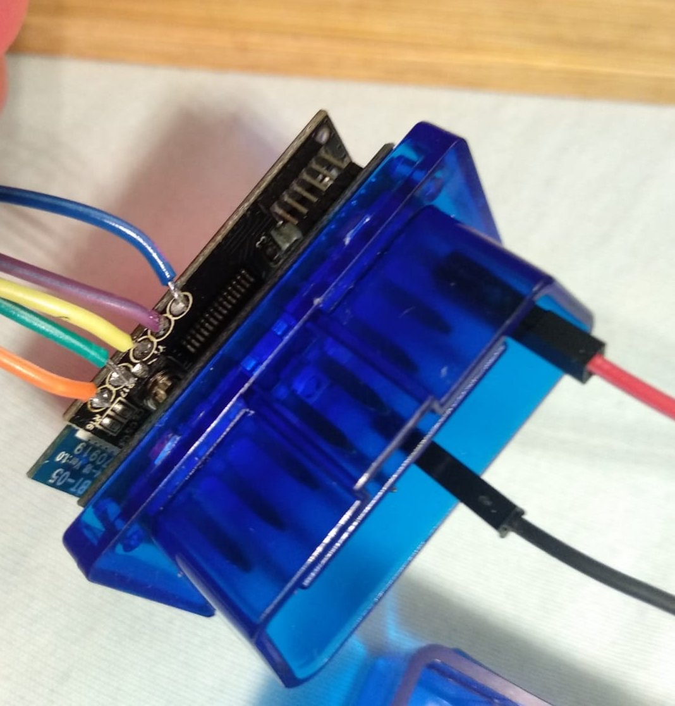

# Replace ELM327 BT HC04

This chapter describes how to replace the ELM327 HC04 PIC18F25K80 firmware

### Hardware Requirements:

* ELM327 with Double Sided PCB. You can find it on Aliexpress. Search for "ELM327 PCB". There are two variants. Refer to https://github.com/uholeschak/ediabaslib/issues/39
* PicKit 3 
* some wires to tinker with
* (Optional but recommended) ODB2 Breakout Board

### ELM327 board connections:

[](hc04-pinout.jpg)

From right to left:
MCLR (orange),
5V (green)
GND (yellow)
PGD (purple)
PGC (blue)

## Step1: Get the needed software:

1. Download the PicKit3 Software (standalone) and extract it somewhere
2. Edit the PICkit3.ini in the folder of Pickkit3  and add the following lines to the end of it:
```
TMEN:
REVS: Y 
```
3. Download the File PKPlusDeviceFile.dat from https://sourceforge.net/projects/pickit3plus/
4. Delete original PK2DeviceFile.dat in the Pickkit 3 folder, and rename PKPlusDeviceFile.dat to PK2DeviceFile.dat 
5. Download the binary package from https://github.com/uholeschak/ediabaslib/releases

## Step2: Program the PIC18F25K80
* Connect your PicKit 3/4 to the ELM327(see photo above)
* Connect 12V to the ODB port(pin 4 and 16): https://www.obd-2.de/stecker-belegungen.html
* Take CanAdaapterElm.X.production.unified.hex`from  hc04 folder of the binary package
* Start Pickkit Software, try to read the device. Do not continue until you get a proper hex file
* Try to flash the device. If it fails with the error "Cannot flash Device-ID", then edit it using Tools->Testmemory to the value in the original hex-file

## Step3: Testing
* Power the Elm327 adapter
* Connect to XXYYZZ BT device and pair with it (standard pincode: 1234)
* Connect to the COM port assigned to your BT device
* When sending strings to the adapter you should at least get an echo from the adapter, otherwise there is a problem with the connections.  
You could test reading the ignition pin with the following command (hex values):  
`82 F1 F1 FE FE 60`  
The response is (additionally to the echo):  
`82 F1 F1 FE <state> <checksum>` with state bit 0 set to 1 if ignition is on.  
